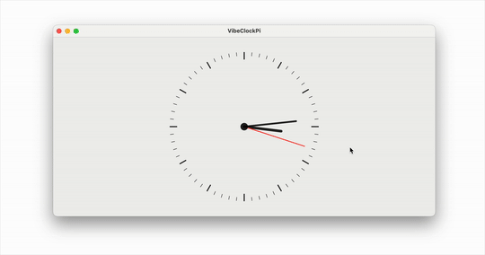

# Vibing Pi o'Clock

[](Resources/VibeClockPi.gif)

When I wrote up [Piterator.swift](https://samgrover.com/2025/03/14/yesterday-it-dawned-on-me.html) on [Pi Day](https://en.wikipedia.org/wiki/Pi_Day) earlier this month, I was actually trying to do something with the values it returns but I didn't get around to that fun part due to lack of time.

A few days after that I imagined a clock face where the seconds hand moves in jumps of the values returned by the iterator at the rate of once per second. So as the values start coming in like 3, 1, 4, etc, the second hand jumps by those many seconds.

I started to write the code for a Mac app but Quartz 2D drawing is not something I have ever really done, so it was tricky wrapping my mind around the coordinate system and laying out individual marks on the canvas.

Fast forward to yesterday when I decided to try out [vibe coding](https://simonwillison.net/2025/Mar/19/vibe-coding/) for this project. As I got going though, it became more of an AI assisted coding because I started to edit it myself after a couple of initial rounds of code generation. Old habits die hard!

For this purpose I used the recently released [Google's Gemini 2.5 Pro](https://blog.google/technology/google-deepmind/gemini-model-thinking-updates-march-2025/#gemini-2-5-thinking) via [LLM](https://llm.datasette.io/en/stable/), essentially as described in [this post](https://simonwillison.net/2025/Mar/26/notes/).

I was very impressed by the code generation. The first prompt I gave was for a static drawing, and it was thus:

```
llm -m gemini-2.5-pro-exp-03-25 "Write a SwiftUI View that draws a clock face on a Canvas. It should draw each of the 60 tick marks, with 0 and every multiple of 5 being a slightly thicker tick mark. It should also draw the time using an hour hand, a minute hand and a second hand. The second hand should be red. The time should be 10th hour, 10th minute, 30th second."
```

The result was exactly as I expected. It even improvised and put that little circle in the center which was a nice touch.

Then I gave it this second prompt which also included the `Piterator.swift` code:

```
files-to-prompt . -e swift -c | \
      llm -m gemini-2.5-pro-exp-03-25 -s \
      'Update the ClockView to make it animatable using TimelineView. Then hook it up to Piterator so that every second, the second hand moves forward by as many seconds as the number returned by the Piterator.'
```

This generated code that had a couple of small bugs that raised compiler errors. After I resolved that I had it working exactly as I envisioned it, and the whole thing took about an hour 🤯

